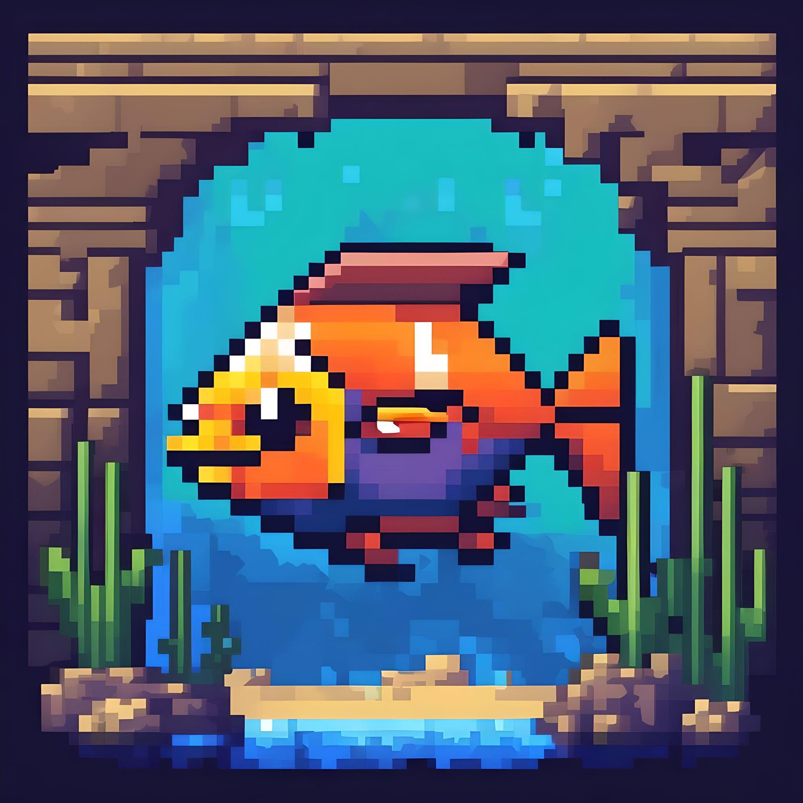
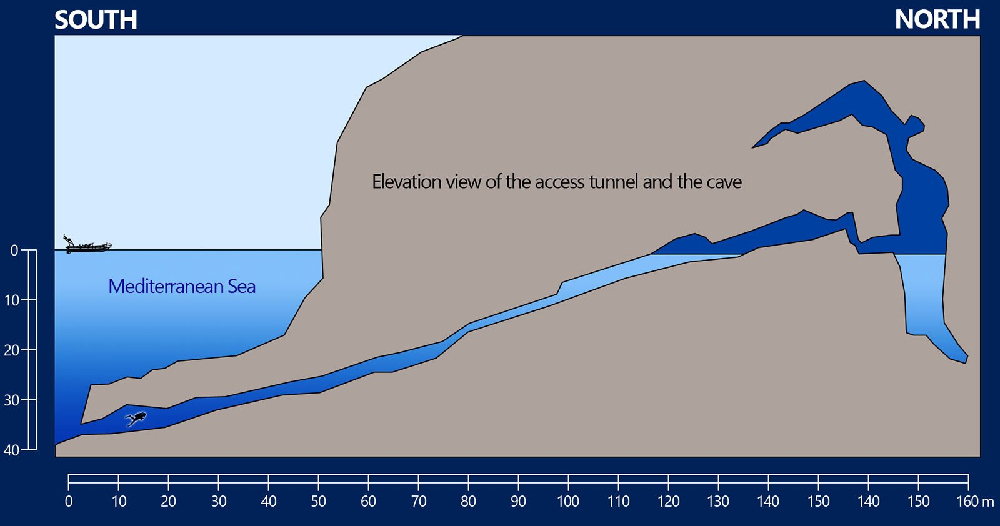

# Cosquer Cave Explorer

Welcome to **Cosquer Cave Explorer**, a cave exploration game where you navigate as a fish through the mysterious, prehistoric Cosquer Cave! Encounter crabs, larger fish, and collect prehistoric paintings as you journey through this dark, underwater world.

<p align="center">
    
</p>

---

## 🎮 Gameplay Screenshot

<p align="center">
    
</p>

---

## 🏞️ Real Cosquer Cave Structure

Explore a virtual recreation of the real Cosquer Cave, a prehistoric underwater site near Marseille. Here's a glimpse of what the real cave looks like:

<p align="center">
    
</p>

> *Image of the real Cosquer Cave from historical archives, showing its prehistoric paintings and underwater environment.*

---

## 🐠 Features

- Large cave map divided into multiple tiles for exploration.
- Smooth 8-directional player movement.
- Enemy AI including crabs and large fish.
- Collectible prehistoric paintings scattered around the cave.
- Dynamic lighting to simulate the dark underwater environment.
- Health system with visible hearts.

---

## 🚀 Getting Started

To run the game locally, follow these steps:

1. **Clone the repository**:
   ```bash
   git clone https://github.com/YourUsername/CosquerGame.git
   ```

2. **Navigate to the project directory**:
   ```bash
   cd CosquerGame
   ```

3. **Run the project**:
   ```bash
   ./gradlew run
   ```

---

## 📚 Technologies Used

- Java
- Gradle
- Swing for UI components

---

## 🔥 Contributing

Feel free to open issues and pull requests if you'd like to contribute! Any suggestions or improvements are always welcome.

---

## 📄 License

This project is licensed under the MIT License.

---

## 🛠️ Badges


